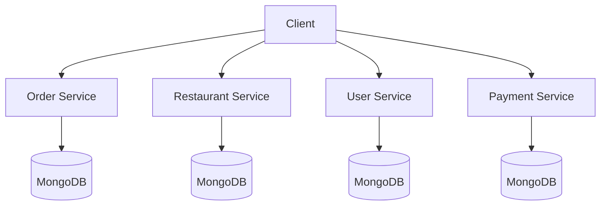

<h1 align="center">🍔 Food Delivery Backend 🚀</h1>
<h3 align="center">Microservices Architecture with Node.js, Express & MongoDB</h3>

<p align="center">
  
</p>

---

## 📋 Overview

This is the backend of the **Food Delivery Service** built using a **microservices architecture**. The project is designed using **Node.js**, **Express**, **JWT (JSON Web Token)** for authentication, and **MongoDB** for the database. The application is split into multiple microservices, each handling a specific domain (Order, Restaurant, Payment, and User services), communicating with each other independently.

---

## 🛠️ Technologies Used

<div align="center">


</div>

- **Node.js**: JavaScript runtime for building the backend
- **Express.js**: Web framework for Node.js, used for building RESTful APIs
- **JWT**: Used for authentication and authorization
- **MongoDB**: NoSQL database to store data related to orders, users, restaurants, and payments
- **Microservices Architecture**: The backend is divided into multiple services that are independent and communicate via APIs

---

## ✨ Features

### **🛒 Order Service**
- ✅ Create and manage orders
- ✅ Fetch orders based on `orderId` and `userId`
- ✅ Update order status (e.g., "Completed", "Pending", "Cancelled")
- ✅ Cancel orders
  
### **🍽️ Restaurant Service**
- ✅ Add new restaurants to the system
- ✅ Manage restaurant categories and dishes
- ✅ Fetch restaurant details

### **👤 User Service**
- ✅ User signup and login with JWT-based authentication
- ✅ Secure login and token-based user session management

### **💳 Payment Service**
- ✅ Create payments for orders
- ✅ Retrieve payment status
- ✅ Process refunds for completed payments

---

## 🏗️ Microservices Architecture

The application is designed using a **microservices architecture**. Each service (Order, Restaurant, Payment, User) is isolated and manages its own database and logic. This architecture ensures that each service can be deployed and scaled independently.

<div align="center">



</div>

- **Order Service**: Handles the creation, status, and cancellation of orders
- **Restaurant Service**: Manages restaurants, categories, and dishes
- **User Service**: Manages user authentication (signup and login) using JWT
- **Payment Service**: Manages payment creation, status retrieval, and refund functionality

These services communicate with each other via HTTP API calls, ensuring a **loosely coupled** system where each service operates independently.

---

## 🚀 Setup Instructions

### Prerequisites

- Node.js (v14 or later)
- MongoDB (Local or Cloud)
- JWT secret and MongoDB URI in `.env` file

### Steps to Run the Project

1. **Clone the repository**:
   ```bash
   git clone https://github.com/your-username/food-delivery-backend.git
   cd food-delivery-backend
   ```

2. **Install dependencies**:
   ```bash
   npm install
   ```

3. **Create a `.env` file** in the root directory and add:
   ```env
   MONGO_URI=your_mongodb_connection_string
   JWT_SECRET=your_jwt_secret_key
   PORT=5000
   ```

4. **Start the services**:
   ```bash
   # Start Order Service
   cd order-service
   npm start

   # Start Restaurant Service
   cd restaurant-service
   npm start

   # Start User Service
   cd user-service
   npm start

   # Start Payment Service
   cd payment-service
   npm start
   ```

5. **Access the API**:
   - Order Service: `http://localhost:5001`
   - Restaurant Service: `http://localhost:5002`
   - User Service: `http://localhost:5003`
   - Payment Service: `http://localhost:5004`

---

## 📡 API Endpoints

### User Service
- `POST /api/users/signup` - Register a new user
- `POST /api/users/login` - Login user

### Order Service
- `POST /api/orders` - Create new order
- `GET /api/orders/:orderId` - Get order by ID
- `PUT /api/orders/:orderId` - Update order status
- `DELETE /api/orders/:orderId` - Cancel order

### Restaurant Service
- `POST /api/restaurants` - Add new restaurant
- `GET /api/restaurants` - Get all restaurants
- `GET /api/restaurants/:restaurantId` - Get restaurant by ID

### Payment Service
- `POST /api/payments` - Create payment
- `GET /api/payments/:paymentId` - Get payment status
- `POST /api/payments/refund` - Process refund

---

## 📂 Project Structure

```
food-delivery-backend/
├── order-service/
│   ├── models/
│   ├── routes/
│   ├── controllers/
│   └── server.js
├── restaurant-service/
│   ├── models/
│   ├── routes/
│   ├── controllers/
│   └── server.js
├── user-service/
│   ├── models/
│   ├── routes/
│   ├── controllers/
│   └── server.js
├── payment-service/
│   ├── models/
│   ├── routes/
│   ├── controllers/
│   └── server.js
├── .env
└── README.md
```

---

## 🤝 Contributing

Contributions are welcome! Please feel free to submit a Pull Request.

1. Fork the Project
2. Create your Feature Branch (`git checkout -b feature/AmazingFeature`)
3. Commit your Changes (`git commit -m 'Add some AmazingFeature'`)
4. Push to the Branch (`git push origin feature/AmazingFeature`)
5. Open a Pull Request

---

## 📧 Contact

<div align="center">

[](https://www.linkedin.com/in/your-profile/)
[](mailto:your-email@gmail.com)
[](https://github.com/your-username)
[](https://your-portfolio.com)

</div>

---

## 📄 License

This project is licensed under the MIT License - see the [LICENSE](LICENSE) file for details.

---

<div align="center">

### ⭐ Don't forget to star this repo if you found it helpful!

Made with ❤️ by [Your Name]

</div>
